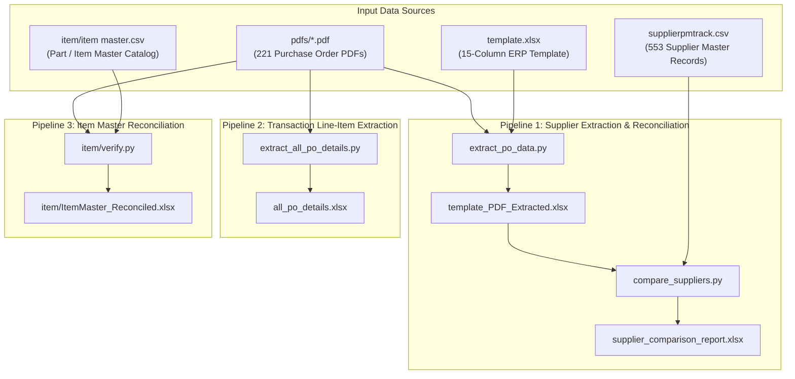

# Purchase Order (PO) Processing & Master Data Reconciliation System

A high-performance Python data pipeline for batch-processing scanned/digital Purchase Order (PO) PDFs, extracting structured vendor and transactional data, and reconciling against corporate **Supplier Master** and **Item/Part Master** catalogs.

---

## Table of Contents

1. [Architecture & Workflow Overview](#architecture--workflow-overview)
2. [Data Flow Diagram](#data-flow-diagram)
3. [Component Logic Breakdown](#component-logic-breakdown)
   - [1. Supplier Profile Extraction (`extract_po_data.py`)](#1-supplier-profile-extraction-extract_po_datapy)
   - [2. Supplier Master Verification (`compare_suppliers.py`)](#2-supplier-master-verification-compare_supplierspy)
   - [3. Line-Item Transaction Extraction (`extract_all_po_details.py`)](#3-line-item-transaction-extraction-extract_all_po_detailspy)
   - [4. Item Master Reconciliation (`item/verify.py`)](#4-item-master-reconciliation-itemverifypy)
4. [Master Datasets & Schemas](#master-datasets--schemas)
5. [Installation & Requirements](#installation--requirements)
6. [Execution Guide](#execution-guide)
7. [Operational Notes & Troubleshooting](#operational-notes--troubleshooting)

---

## Architecture & Workflow Overview

This repository automates three main business processes:

1. **Vendor Onboarding & Audit**: Ingests PO PDFs, extracts complete vendor details (GSTIN, PAN, Address, Contact, Payment Terms), deduplicates vendors, formats data into ERP templates, and checks for missing suppliers against the corporate database.
2. **Transaction Ledger Extraction**: Extracts line-item tables (quantities, rates, taxes, and net totals) across all PO PDFs into a unified transaction dataset.
3. **Item Catalog Reconciliation**: Scans PO lines for ordered item codes/part numbers, filters out false positives, and verifies them against the official Item Master catalog to highlight uncataloged purchases.

---

## Data Flow Diagram



---

## Component Logic Breakdown

### 1. Supplier Profile Extraction (`extract_po_data.py`)

Extracts supplier header details from all PDFs in `pdfs/` and populates the `PDF Extracted Data` sheet inside `template_PDF_Extracted.xlsx`.

#### A. Coordinate-Based Text Reconstruction (`get_pdf_text`)
Standard text extraction often jumbles multi-column PDF layouts. To ensure high fidelity:
* Extracts word bounding boxes `(x0, y0, x1, y1, word)` using `page.get_text("words")`.
* Sorts words by vertical position (`y0`).
* Groups words into a single line if their vertical coordinate delta `y0 - prev_y <= 2.0` px.
* Sorts words within each line by horizontal coordinate (`x0`).
* Rebuilds lines sequentially per page.

#### B. Header & Metadata Scoping (`extract_header`)
* **PO Header Detection**:
  ```regex
  ^([A-Z0-9 &.,()'-]+)\s+([A-Z0-9]+/[A-Z0-9-]+/[A-Z0-9/]+)\s+(\d{2}-\d{2}-\d{4})$
  ```
  Extracts Supplier Name, PO Number, and PO Date from the header line. Includes secondary fallbacks if layout variances occur.
* **Supplier Section Scoping**: Splits text at `"SUPPLIER / MANUFACTURER"` or `"PURCHASE ORDER"` to ensure buyer details (company's own GST/Address at the top) are excluded from supplier metadata.
* **Metadata Extraction**:
  * **GSTIN**: `GST NO\s*:?\s*([0-9A-Z]{15})`
  * **PAN**: `PAN NO\s*:?\s*([A-Z0-9]{10})`
  * **Email**: `E-MAIL\s*:?\s*([A-Z0-9._%+-]+@[A-Z0-9.-]+\.[A-Z]{2,})`
  * **Contact No**: `CONTACT NO\s*:?\s*([a-zA-Z0-9].*)`
  * **Payment Terms**: `PAYMENT TERMS\s*:?\s*([a-zA-Z0-9].*)`
  * **Delivery Schedule & Mode**: Extracted via targeted regex expressions.
* **Address Extraction**:
  * Identifies lines following the supplier name.
  * Collects up to 3 address lines (`Add_Line1`, `Add_Line2`, `Add_Line3`).
  * Stops address collection upon encountering section delimiters: `REQUISITION`, `STATE`, `PAN NO`, `GST NO`, `E-MAIL`, `CONTACT NO`, `SR NO`, `DESCRIPTION`.
  * Extracts **PIN Code**: `\b(\d{6})\b` from the full address string.
  * Extracts **City**: `\b([A-Za-z\s]+?)(?:\s*-\s*|\s+)\d{6}`.
  * Determines **State**: Regex match on `STATE:` keyword, defaulting to `MAHARASHTRA` if mentioned in the address.
  * Country Code: Defaults to `IN` if India, Maharashtra, or an Indian State is detected.

#### C. Deduplication & Merge Logic
Multiple POs from the same supplier may contain partially overlapping details.
* Normalizes supplier name keys via `clean(supplier_name).lower()`.
* Merges populated attributes into an aggregate dictionary so missing fields in one PO are enriched by fields found in another PO for that vendor.

#### D. Template Alignment & Formatting
* Loads `template.xlsx` and reads column headers from `Sheet1`.
* Uses `COLUMN_ALIASES` dictionary to normalize and map extracted fields directly to target ERP columns:
  `CustType`, `CustCode`, `CustName`, `Add_Line1`, `Add_Line2`, `Add_Line3`, `City`, `StateName`, `CountryCode`, `ContactNo`, `EmailId`, `PinCode`, `PaymentTerm`, `GSTNo`, `PANNo`.
* Creates `PDF Extracted Data` sheet, preserves font styling, column widths, number formats, freeze panes (`A2`), and applies Excel AutoFilters.
* Includes fallback saving with timestamp suffix if the target Excel file is locked/open in another process.

---

### 2. Supplier Master Verification (`compare_suppliers.py`)

Verifies extracted suppliers against the master supplier database `supplierpmtrack.csv`.

#### A. Name Normalization (`normalize_name`)
```python
def normalize_name(name):
    if not isinstance(name, str):
        return ""
    return re.sub(r"\s+", " ", name).strip().lower()
```
Removes excess spacing, normalizes casing, and trims padding to ensure accurate matching.

#### B. Lookup & Status Assignment
* Constructs a lookup dictionary mapping `normalized_name -> original_master_name`.
* Iterates through extracted supplier names from `template_PDF_Extracted.xlsx`:
  * **`Present`**: Exact normalized match exists in `supplierpmtrack.csv`.
  * **`Missing`**: Supplier is not found in master records.

#### C. Report Generation (`supplier_comparison_report.xlsx`)
* **`Verification Report` Sheet**: Lists all extracted supplier names, status (`Present` / `Missing`), and the matched master name.
* **`Sheet2`**: Filters `template_PDF_Extracted.xlsx` to extract all 15 master columns for suppliers marked as `Missing`, ready for direct onboarding into the ERP.

---

### 3. Line-Item Transaction Extraction (`extract_all_po_details.py`)

Extracts every transaction line item from all POs into `all_po_details.xlsx` for procurement spend analysis.

#### A. Table Row Parsing (`extract_items`)
Uses primary and secondary regex parsers:
```regex
^(?P<sr>\d+)\s+(?P<description>.+?)\s+(?P<qty>[\d,]+(?:\.\d+)?)\s+(?P<unit>[A-Za-z]+)\s+(?P<rate>[\d,]+(?:\.\d+)?)\s+(?P<rate_unit>[A-Za-z /]+)\s+(?P<value>[\d,]+(?:\.\d+)?)\s+(?P<discount_amt>[\d,]+(?:\.\d+)?)\s+(?P<discount_pct>[\d,]+(?:\.\d+)?)\s+(?P<after_discount>[\d,]+(?:\.\d+)?)$
```
* **Continuation Descriptions**: If a line doesn't match the regex but an item is currently active, text is appended to `description` until a stop keyword is encountered (`Total`, `PACKING`, `FREIGHT`, `CGST`, `SGST`, `IGST`, `PAYMENT`, `NOTES`).

#### B. Financial Field Sanitization (`number`)
* Strips commas (`1,25,000.00` -> `125000.00`).
* Converts values into standard Python `float`.
* Captures PO tax footers: `CGST`, `SGST`, `IGST`, and `Grand Total`.

---

### 4. Item Master Reconciliation (`item/verify.py`)

Scans all PO files for part/item codes and reconciles them against `item/item master.csv`.

#### A. Code Normalization (`normalize_item`)
* Strips Excel `.0` decimal formatting from numeric part codes.
* Eliminates delimiters, spaces, hyphens, slashes, and periods: `re.sub(r"[\s\-_\/\\\.]+", "", value)`.
* Retains alphanumeric characters: `re.sub(r"[^A-Z0-9]", "", value)`.

#### B. Dynamic Column Auto-Discovery (`find_column`)
Automatically resolves item code columns across varying column conventions (`ItemCode`, `ItemNo`, `Item Number`, `Part Number`, `Material Code`).

#### C. Candidate Code Recognition
Scans PO text using item code regexes:
* `\b[A-Z]{1,10}[-_/]?\d{2,}[A-Z0-9\-_/]*\b`
* `\b\d{2,}[-_/][A-Z0-9\-_/]+\b`

#### D. 8-Stage False Positive Filtering (`is_valid_item_code`)
PO text frequently contains tokens that look like part codes. The script runs each candidate through 8 validation rules:
1. **Date Check**: Discards dates in formats like `DD-MM-YYYY`, `YYYY-MM-DD`, or `DD-Mon-YYYY`.
2. **PAN Check**: Rejects standard 10-character PAN patterns (`^[A-Z]{5}\d{4}[A-Z]$`).
3. **GSTIN Check**: Rejects 15-character GSTIN identifiers (`^\d{2}[A-Z]{5}\d{4}[A-Z][A-Z0-9]Z[A-Z0-9]$`).
4. **Phone Numbers**: Rejects strings containing 10-digit consecutive sequences.
5. **PIN Codes**: Filters out Maharashtra postal PINs (`40xxxx` to `44xxxx`).
6. **Financial Years / PO Numbers**: Excludes fiscal year tokens (`24-25`, `25-26`, `26-27`) and years (`2024`–`2027`).
7. **Self-Reference Filter**: Discards codes matching the PO number or filename itself.
8. **Contextual Stopwords & Locations**: Rejects candidate lines containing terms such as:
   * Tax/Commercial terms: `gst`, `tax`, `subtotal`, `freight`, `discount`, `inr`, `rs.`.
   * Contact info: `email`, `tel`, `phone`, `www.`, `@`.
   * Location tokens: `midc`, `industrial estate`, `surajpur`, `thane`, `mumbai`, `ambernath`, `bhiwandi`.

#### E. Reconciliation Output (`ItemMaster_Reconciled.xlsx`)
* **`Item Master`**: Clean copy of current catalog records.
* **`Missing PO Items`**: Items referenced in POs that do not exist in the master catalog.
* **`PO Item Sources`**: Cross-reference detailing which PO file and PO number contained each missing item.
* **`Reconciliation Report`**: Executive summary table containing:
  * Total PO files processed
  * Total PO item lines parsed
  * Items matched in Item Master
  * Unique missing items count

---

## Master Datasets & Schemas

| Dataset | Format | Key Fields | Purpose |
| :--- | :--- | :--- | :--- |
| `template.xlsx` | Excel (0 data rows) | 15 ERP vendor fields (`CustType`, `CustCode`, `CustName`, `Add_Line1`, `City`, `StateName`, `PinCode`, `GSTNo`, `PANNo`, etc.) | Layout reference for extracted vendor data. |
| `supplierpmtrack.csv` | CSV (553 rows) | Matches `template.xlsx` columns without `Status`. | Corporate supplier master list. |
| `Supplier_master.xlsx` | Excel (464 rows) | Matches `template.xlsx` with an extra `Status` column. | Alternate supplier catalog. |
| `item/item master.csv`| CSV (823 KB) | `ItemNo`, `ItemCode`, `ItemSize`, `ItemDesc`, `Main_Group`, `Item_Group`, `StoreName`, `TariffHeadNo` | Official item and parts catalog. |

---

## Installation & Requirements

### System Requirements
* Python 3.10+ (tested on Python 3.12 / 3.14)
* Standard CPython environment (Windows / Linux / macOS)

### Dependencies
Install the required packages using `pip`:

```bash
pip install pandas openpyxl pymupdf
```

---

## Execution Guide

Run the scripts from the repository root directory in the following sequence:

### Step 1: Extract Supplier Headers & Profile Info
```bash
python extract_po_data.py
```
* **Input**: `template.xlsx`, `pdfs/*.pdf`
* **Output**: `template_PDF_Extracted.xlsx`

### Step 2: Compare Extracted Suppliers with Master
```bash
python compare_suppliers.py
```
* **Input**: `template_PDF_Extracted.xlsx`, `supplierpmtrack.csv`
* **Output**: `supplier_comparison_report.xlsx`

### Step 3: Extract Granular PO Line-Item Transactions
```bash
python extract_all_po_details.py
```
* **Input**: `pdfs/*.pdf`
* **Output**: `all_po_details.xlsx`

### Step 4: Reconcile Items Against Item Master
```bash
python item/verify.py
```
* **Input**: `pdfs/*.pdf`, `item/item master.csv`
* **Output**: `item/ItemMaster_Reconciled.xlsx`

---

## Operational Notes & Troubleshooting

1. **Excel Permission / Lock Handling**:
   * If any output Excel file is open in Microsoft Excel when a script runs, the script automatically catches `PermissionError` and writes the output with a timestamp or counter suffix (e.g. `template_PDF_Extracted_<timestamp>.xlsx`).
2. **Path Portability in `item/verify.py`**:
   * Ensure `PO_FOLDER`, `ITEM_MASTER_FILE`, and `OUTPUT_FILE` in `item/verify.py` are set to paths relative to `Path(__file__).resolve().parent` so they run portably across different developer machines.
3. **Git Hygiene**:
   * Build artifacts, runtime caches (`__pycache__/`, `*.pyc`), log files (`*.log`), and temporary Excel locks (`~$*.xlsx`) should be ignored via `.gitignore`.
